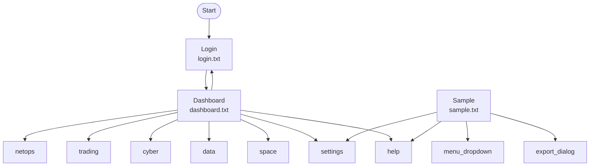

# UI Flow Diagram

## Detected Screens

- **dashboard.txt** → login.txt, netops.txt, trading.txt, cyber.txt, data.txt, space.txt, settings.txt, help.txt
- **login.txt** → dashboard.txt
- **sample.txt** → menu_dropdown.txt, export_dialog.txt, settings.txt, help.txt
