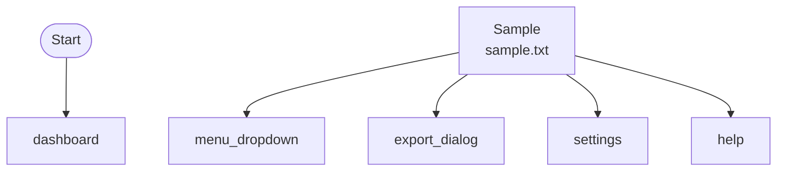

# UI Flow Diagram

```mermaid
flowchart TB
    Start([Start])
    sample[Sample<br/>sample.txt]
    Start --> dashboard
    sample --> menu_dropdown
    sample --> export_dialog
    sample --> settings
    sample --> help
```

## Detected Screens

- **sample.txt** → menu_dropdown.txt, export_dialog.txt, settings.txt, help.txt
